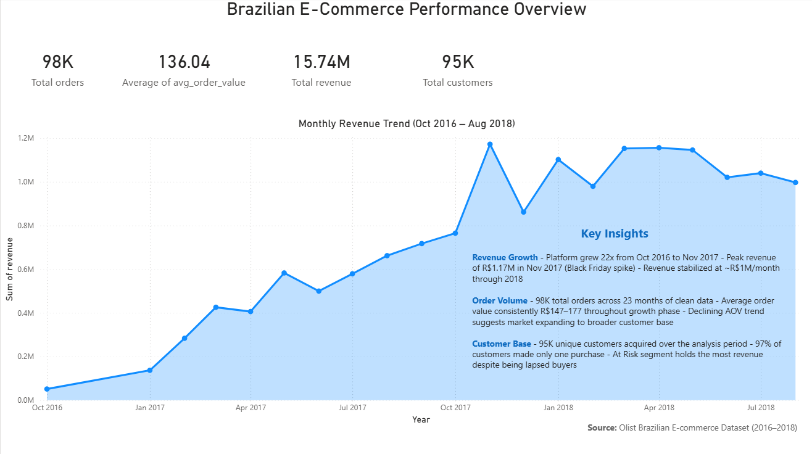
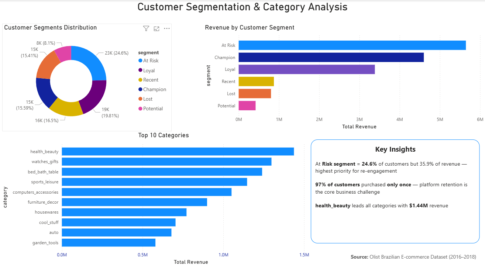
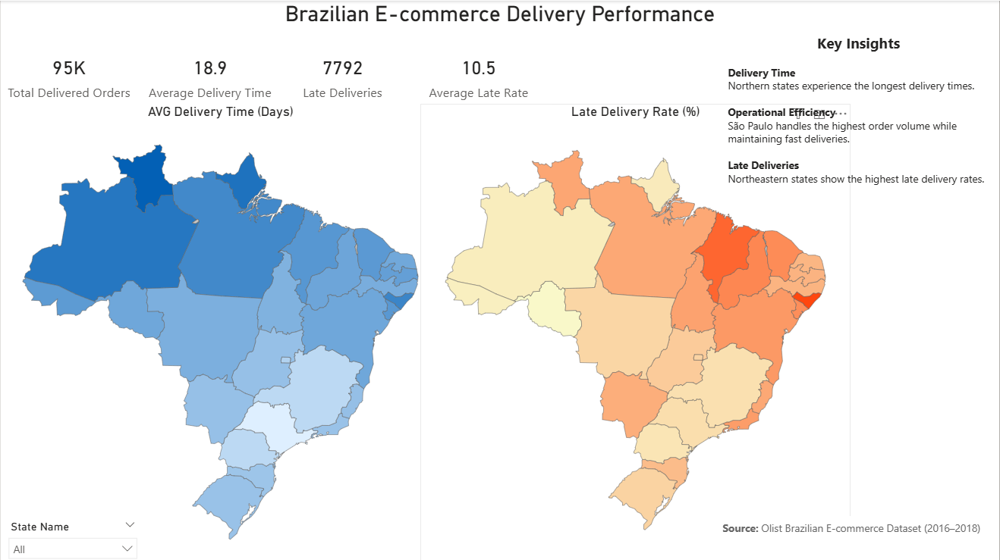
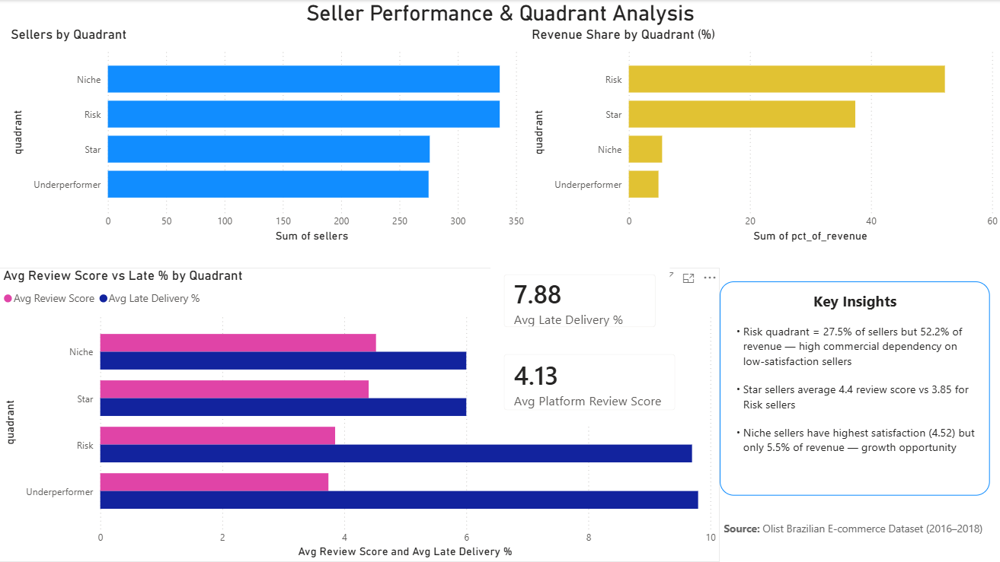

# Olist Brazilian E-Commerce Analysis

## End-to-End SQL & Power BI Portfolio Project

This project analyzes the **Olist Brazilian E-Commerce Public Dataset** from Kaggle, containing approximately **100,000 real e-commerce transactions** between **2016 and 2018**.

The objective was to simulate a real-world analytics workflow—from raw transactional data through data quality assessment, cleaning, business analysis, and interactive dashboard development.

The project demonstrates practical SQL skills, data validation techniques, business analysis, and dashboard design using **PostgreSQL** and **Power BI**.

---

# Project Overview

This project follows the complete analytics lifecycle:

- Data profiling and quality assessment
- Data cleaning and transformation
- Post-cleaning quality assurance
- Business analysis using SQL
- Exporting analytical datasets
- Building interactive Power BI dashboards

The final dashboard answers key business questions regarding:

- Revenue growth
- Product category performance
- Delivery performance
- Customer behavior
- Seller performance

---

# Dataset

**Source:** Olist Brazilian E-Commerce Public Dataset (Kaggle)

The dataset contains information about:

- Customers
- Orders
- Products
- Sellers
- Payments
- Reviews
- Geolocation

Approximately:

- **100,000 orders**
- **95,000 customers**
- **33,000 sellers**
- **2016–2018**

---

# Tools & Technologies

| Tool | Purpose |
|-------|---------|
| PostgreSQL | Data storage, profiling, cleaning & analysis |
| SQL | Data transformation & business analysis |
| Power BI | Dashboard development & visualization |
| Git & GitHub | Version control & project documentation |

---

# Repository Structure

```text
olist-ecommerce-analysis
│
├── README.md
├── data_cleaning_documentation.md
├── images/
│
└── analysis/
    │
    ├── sql/
    │   ├── profiling/
    │   ├── cleaning/
    │   ├── qa/
    │   └── analysis/
    │
    ├── exports/
    │
    └── powerbi/
```

---

# SQL Workflow

The SQL project is organized into four logical stages.

## 1. Data Profiling

Initial exploration of the dataset including:

- Dataset overview
- Missing value analysis
- Duplicate detection
- Data type validation
- Business rule validation

---

## 2. Data Cleaning

Individual cleaning scripts were created for every major table:

- Orders
- Products
- Customers
- Sellers
- Reviews
- Geolocation
- Category Translation

The complete cleaning process is documented in:

**data_cleaning_documentation.md**

---

## 3. Quality Assurance

After cleaning, validation queries verify:

- Record counts
- Referential integrity
- Business rules
- Data consistency

---

## 4. Business Analysis

The final SQL analysis consists of five analytical modules:

| Script | Business Question |
|---------|-------------------|
| 01_monthly_revenue.sql | How did revenue and order volume evolve over time? |
| 02_category_performance.sql | Which product categories generate the highest revenue? |
| 03_delivery_performance.sql | How efficient is the delivery process across Brazil? |
| 04_customer_segmentation.sql | Which customer segments generate the most value? |
| 05_seller_performance.sql | Which sellers drive marketplace performance? |

The resulting datasets are exported as CSV files and imported into Power BI.

---

# Power BI Dashboard

The project includes an interactive dashboard consisting of four report pages.

---

## Executive Overview



This dashboard presents high-level marketplace KPIs including:

- Total Revenue
- Total Orders
- Average Order Value
- Customer Growth
- Monthly Revenue Trend

---

## Customer & Category Analysis



Key analyses include:

- RFM Customer Segmentation
- Revenue by Customer Segment
- Revenue by Product Category
- Customer Distribution

---

## Delivery Performance



This report focuses on logistics performance across Brazilian states:

- Average Delivery Time
- Late Delivery Rate
- Geographic Comparison
- Regional Performance

---

## Seller Performance



Seller performance is evaluated using:

- Revenue
- Customer Reviews
- Delivery Reliability
- Seller Quadrant Analysis

The quadrant analysis classifies sellers as:

- ⭐ Star
- ⚠️ Risk
- 💡 Niche
- 📉 Underperformer

---

# Key Business Insights

## Revenue

- Revenue increased steadily throughout the analysis period before stabilizing in 2018.
- Black Friday generated the highest monthly revenue.

---

## Customers

- Approximately **97%** of customers made only one purchase.
- The **At Risk** customer segment contributes a significant share of marketplace revenue, highlighting customer retention opportunities.

---

## Products

- **Health & Beauty** is the highest revenue-generating category.
- A relatively small number of product categories account for most marketplace sales.

---

## Delivery

- Delivery performance varies considerably between Brazilian states.
- Northern regions generally experience longer delivery times and higher late-delivery rates.

---

## Sellers

- A relatively small group of sellers generates most marketplace revenue.
- High-revenue sellers with lower customer review scores represent a potential business risk.

---

# Skills Demonstrated

### SQL

- Complex JOINs
- Common Table Expressions (CTEs)
- Window Functions
- Aggregate Functions
- CASE Expressions
- Data Cleaning
- Data Validation

### Analytics

- Exploratory Data Analysis (EDA)
- KPI Development
- Business Analysis
- Customer Segmentation (RFM)
- Seller Performance Analysis

### Visualization

- Power BI
- Dashboard Design
- Interactive Reporting
- Business Storytelling

### Development

- Git
- GitHub
- Project Documentation

---

# Author

**Dmytro Miroshnikov**

Junior Data Analyst

GitHub: https://github.com/DmMir1
